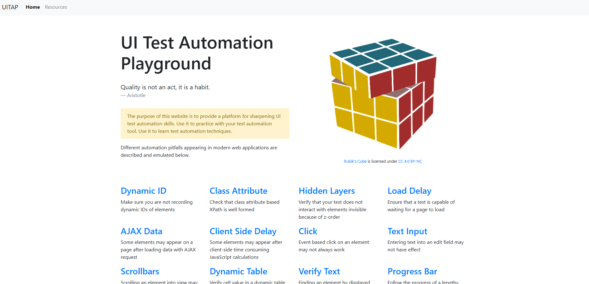

<a id="readme-top"></a>
[![Stargazers][stars-shield]][stars-url]
[![LinkedIn][linkedin-shield]][linkedin-url]

<!-- PROJECT LOGO -->
<br />
<div align="center">
  <a href="https://github.com/akosszajb/UITAP">
    
  </a>

<h3 align="center">UITAP-Tests - A Test Automation Project</h3>

  <p align="center">
   Full Website Testing
    <br />
    <a href="https://github.com/akosszajb/UITAP"><strong>Explore the docs »</strong></a>
    <br />
    <br />
   <a href="https://github.com/akosszajb/UITAP/issues/new?labels=bug&template=bug-report.md">Report Bug</a>
    ·
    <a href="https://github.com/akosszajb/UITAP/issues/new?labels=enhancement&template=feature-request.md">Request Feature</a>
  </p>
</div>


<!-- TABLE OF CONTENTS -->
<details>
  <summary>Table of Contents</summary>
  <ol>
    <li>
      <a href="#about-the-project">About The Project</a>
      <ul>
        <li><a href="#built-with">Built With</a></li>
      </ul>
    </li>
    <li>
      <a href="#getting-started">Getting Started</a>
      <ul>
        <li><a href="#prerequisites">Prerequisites</a></li>
        <li><a href="#installation">Installation</a></li>
      </ul>
    </li>
    <li><a href="#license">License</a></li>
    <li><a href="#contact">Contact</a></li>
    <li><a href="#acknowledgments">Acknowledgments</a></li>
  </ol>
</details>


<!-- ABOUT THE PROJECT -->
## About The Project

<div align="center">
  <a href="http://uitestingplayground.com/">
    
  </a>
</div>


System Under Test: UI Test Automation Playground Website

This project focuses on testing the UI Test Automation Playground Website (http://uitestingplayground.com/) using Page Object Model and tests with NUnit. The project focusing on functional testing (black box testing), the automation is achieved through Selenium, with tests written in C#, to ensure both functionality and user-friendliness. The tests cover a variety of scenarios to verify the website’s responsiveness and usability.

The entire website has been thoroughly tested, including all major components such as navigation bars, buttons, forms, and dynamic elements, to ensure that every interaction behaves as expected. Automated tests are designed to detect any issues early, improving both the quality and reliability of the website.

(The project is educational in nature and plays an important role in expanding my practical experience in testing. Its purpose is to provide me with an opportunity to learn various aspects of UI automated testing, including the use of Selenium, NUnit, and C#. Throughout the testing process, I have learned several new techniques that help me execute tests more efficiently and reliably. The project offers me the chance to gain a deeper understanding of how web applications function and the testing processes involved, while also providing hands-on experience in the field of automated testing.)

<p align="right">(<a href="#readme-top">back to top</a>)</p>


### Built With

List of the major frameworks/libraries/IDE used to bootstrap this project.

* [![C#][C#]][C#-url]
* [![Selenium][Selenium]][Selenium-url]
* [![NUnit][NUnit]][NUnit-url]
* [![NUnit ConsoleRunner][NUnit ConsoleRunner]][ConsoleRunner-url]
* [![JetBrainsRider][JetBrainsRider]][JetBrainsRider-url]
* [![GitHub][GitHub]][GitHub-url]
* [![Markdown][Markdown]][Markdown-url]


<p align="right">(<a href="#readme-top">back to top</a>)</p>


<!-- GETTING STARTED -->
## Getting Started

This section will guide you through setting up the project locally. Follow these simple steps to get up and running.

### Prerequisites

Before you begin, make sure you have the following tools installed on your system:
* Node.js - for SUT.
* npm - for SUT.
* .NET SDK (for running and building the C# project) - Download from: https://dotnet.microsoft.com/download
* Selenium WebDriver + ChromeDriver (used for automating browser interactions) - his can be installed via NuGet inside the project.
* NUnit (the testing framework used for this project) - This will also be installed via NuGet inside the project.

Optional:
* JetBrains Rider or Visual Studio (IDE for editing and running the project)
* Download Rider from: https://www.jetbrains.com/rider/
* Download Visual Studio from: https://visualstudio.microsoft.com/

### Installation

SUT:
1. Clone the repository
```
https://github.com/inflectra/ui-test-automation-playground
```
2. In the package folder run
```bash
npm install
```
3. Launch with
```bash
node app.js
```
4. In a browser navigate to
```
http://localhost:3000
```
5. Make sure the SUT is running during the testing.

UITAP -Tests:
1. Clone the repository
```
https://github.com/akosszajb/UITAP
```
2.  In the package folder run
```bash
dotnet test
```
3. Wait for the result of the tests (20 minute)
4. View Results: Test results will be displayed in the terminal, NUnit console or in your IDE's test runner. Any failures will be logged and can be used for debugging.

<p align="right">(<a href="#readme-top">back to top</a>)</p>

<!-- LICENSE -->
## License

Distributed under the MIT License. See `LICENSE.txt` for more information.

<p align="right">(<a href="#readme-top">back to top</a>)</p>


<!-- CONTACT -->
## Contact

Akos Szajbert - kisszajbert@gmail.com

[LinkedIn](https://www.linkedin.com/in/akos-szajbert-7b489126b/)

Project Link: [https://github.com/akosszajb/UITAP](https://github.com/akosszajb/UITAP)

<p align="right">(<a href="#readme-top">back to top</a>)</p>


<!-- ACKNOWLEDGMENTS -->
## Acknowledgments
Resources I find helpful and would like to give credit to.

* [UI Test Automation Playground](http://uitestingplayground.com/)
* [UI Test Automation Playground - Repository](https://github.com/Inflectra/ui-test-automation-playground)
* [Best-README-Template](https://github.com/othneildrew/Best-README-Template)
* [C# language documentation](https://learn.microsoft.com/en-us/dotnet/csharp/)
* [Selenium](https://www.selenium.dev/)
* [JetBrains](https://www.jetbrains.com/rider/)
* [W3Schools](https://www.w3schools.com/)
* [Codecool](https://codecool.com/en/)

<p align="right">(<a href="#readme-top">back to top</a>)</p>


<!-- MARKDOWN LINKS & IMAGES -->
<!-- https://www.markdownguide.org/basic-syntax/#reference-style-links -->
[stars-shield]: https://img.shields.io/github/stars/akosszajb/UITAP.svg?style=for-the-badge
[stars-url]: https://github.com/akosszajb/UITAP/stargazers
[linkedin-shield]: https://img.shields.io/badge/-LinkedIn-black.svg?style=for-the-badge&logo=linkedin&colorB=555
[linkedin-url]: https://www.linkedin.com/in/akos-szajbert-7b489126b/
[product-screenshot]: images/screenshot1.png
[C#]: https://img.shields.io/badge/cSharp-000000?style=for-the-badge&logo=nextdotjs&logoColor=white
[C#-url]: https://learn.microsoft.com/en-us/dotnet/csharp/
[Selenium]: https://img.shields.io/badge/Selenium-000000?style=for-the-badge&logo=nextdotjs&logoColor=4FC08D
[Selenium-url]: https://www.selenium.dev/
[NUnit]: https://img.shields.io/badge/NUnit-000000?style=for-the-badge&logo=nextdotjs&logoColor=FF3E00
[NUnit-url]: https://nunit.org/
[JetBrainsRider]: https://img.shields.io/badge/JetBrains_Rider-000000?style=for-the-badge&logo=nextdotjs&logoColor=white
[JetBrainsRider-url]: https://www.jetbrains.com/rider/
[GitHub]: https://img.shields.io/badge/GitHub-000000?style=for-the-badge&logo=nextdotjs&logoColor=4FC08D
[GitHub-url]: https://github.com/
[Markdown]: https://img.shields.io/badge/Markdown-000000?style=for-the-badge&logo=nextdotjs&logoColor=FF3E00
[Markdown-url]: https://www.markdownguide.org/
[NUnit ConsoleRunner]: https://img.shields.io/badge/NUnit_ConsoleRunner-000000?style=for-the-badge&logo=nextdotjs&logoColor=white
[ConsoleRunner-url]: https://docs.nunit.org/articles/nunit/running-tests/Console-Runner.html
