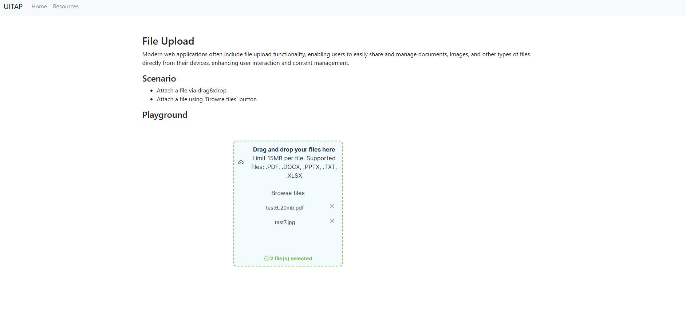

## Describe the bug
2024-11-14
### Defect number (ID)
2
### Title
Multiple Invalid File Upload Accepted without error message
### Summary
The system currently allows unsupported file types to be uploaded without proper validation. The test revealed that the site allows the uploading, and the UI displays a success message even after multiple unsupported files type (e.g., a large PDF or a JPG file) are uploaded.
### Test
FileUploadPageTest04_UploadInvalidFiles_MultipleWrongFiles (test6_20mb.pdf, test7.jpg)
### Environment
Operating System: Windows 10 Pro, 64-bit, 10.0.19045
Browser: Google Chrome, version 131.0.6778.70 (Official Build) (64-bit)
Programming Language: C#
Development Environment: JetBrains Rider 2024.1.1
NUnit: 3.13.3
Microsoft.NET.Test.Sdk: 17.1.0
Selenium.Webdriver.ChromeDriver: 131.0.6778.6900
Selenium Support: 4.26.1
Selenium.Webdriver: 4.26.1
SeleniumExtras.WaitHelpers: 1.0.2

### Steps to reproduce
Open the file upload page (/upload).
Drop multiple invalid files to the "Drag and drop your files here" area (too big - test6_20mb.pdf - or not supported - test7.jpg - files.
Observe the message after upload.
Reproducible: Yes.
### Expected Result
The UI should display an error indicating that the file types are not supported, and the files should not be processed.
### Actual Result
The UI shows a success message stating the files has been selected, which implies the files were uploaded.
### Severity/Priority
High
### Status
Open
### Additional context
Screenshot

  

